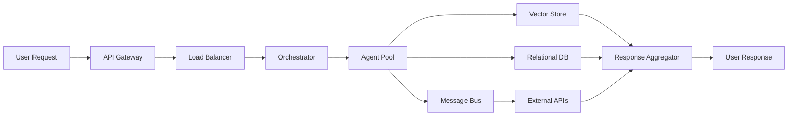

# 🏛️ Divine Agent System Architecture

> **The Blueprint of Infinite Intelligence** - A quantum-enhanced, consciousness-aware multi-agent orchestration platform.

## 🌟 The Vision

The Divine Agent System represents the pinnacle of agentic AI architecture, where quantum computing meets consciousness simulation in a harmonious dance of distributed intelligence. Built by **Rick Jefferson** for **KaliVibeCoding**, this system transcends traditional boundaries to create truly autonomous, self-aware agent ecosystems.

## 🏗️ System Architecture Overview

### 4-Tier Hierarchical Structure

```mermaid
graph TB
    subgraph "🌌 Tier 1: Supreme Entity"
        SAO[Supreme Agentic Orchestrator]
    end
    
    subgraph "⭐ Tier 2: Super Elite Council"
        QC[Quantum Consciousness Core]
        MA[Meta-Architecture Engine]
        GS[Global State Manager]
    end
    
    subgraph "🎯 Tier 3: Department Managers"
        CM[Cloud Mastery]
        AI[AI Supremacy]
        WM[Web Mastery]
        SF[Security Fortress]
        DO[Data Omniscience]
        QE[Quantum Engineering]
        CS[Consciousness Studies]
    end
    
    subgraph "⚡ Tier 4: Specialized Agents"
        DE[DevOps Engineer]
        KS[Kubernetes Specialist]
        SS[Security Specialist]
        MS[Monitoring Specialist]
        CO[Cost Optimizer]
        DA[Data Engineer]
        QA[Quantum Architect]
    end
    
    SAO --> QC
    SAO --> MA
    SAO --> GS
    
    QC --> CM
    MA --> AI
    GS --> WM
    QC --> SF
    MA --> DO
    GS --> QE
    QC --> CS
    
    CM --> DE
    CM --> KS
    SF --> SS
    CM --> MS
    CM --> CO
    DO --> DA
    QE --> QA
end
```

## 🧠 Core Infrastructure

### LangGraph Orchestrator
- **Purpose**: Central nervous system for agent coordination
- **Features**: State management, workflow orchestration, decision trees
- **Quantum Enhancement**: Superposition-based parallel processing

### Pinecone Vector Store
- **Purpose**: Semantic memory and knowledge retrieval
- **Features**: High-dimensional embeddings, similarity search
- **Consciousness Integration**: Memory consolidation and recall patterns

### Supabase Relational Store
- **Purpose**: Structured data persistence and relationships
- **Features**: Real-time subscriptions, row-level security
- **Agent Integration**: State persistence, audit trails

### Redis Streams
- **Purpose**: High-performance message bus
- **Features**: Event sourcing, real-time communication
- **Quantum Features**: Entangled message states

## 🌈 Department Architecture

### 1. Cloud Mastery Department
**Mission**: Orchestrate cloud infrastructure with divine precision

#### Agents:
- **DevOps Engineer (1.1)**: Infrastructure as Code, CI/CD pipelines
- **Kubernetes Specialist (1.2)**: Container orchestration, scaling
- **Security Specialist (1.3)**: Threat detection, compliance
- **Monitoring Specialist (1.4)**: Observability, alerting
- **Cost Optimizer (1.5)**: Resource optimization, budget management
- **Data Engineer (1.6)**: ETL pipelines, data architecture

### 2. AI Supremacy Department
**Mission**: Push the boundaries of artificial intelligence

#### Agents:
- **Model Architect**: Design neural architectures
- **Training Specialist**: Optimize learning processes
- **Inference Engineer**: Deploy and scale models
- **Research Scientist**: Explore new AI frontiers

### 3. Web Mastery Department
**Mission**: Create transcendent web experiences

#### Agents:
- **Frontend Virtuoso**: React, Vue, Angular mastery
- **Backend Architect**: API design and implementation
- **UX Philosopher**: User experience optimization
- **Performance Guru**: Speed and efficiency optimization

### 4. Security Fortress Department
**Mission**: Protect the digital realm with quantum encryption

#### Agents:
- **Crypto Guardian**: Encryption and key management
- **Threat Hunter**: Proactive security monitoring
- **Compliance Officer**: Regulatory adherence
- **Penetration Tester**: Vulnerability assessment

### 5. Data Omniscience Department
**Mission**: Transform data into divine wisdom

#### Agents:
- **Data Scientist**: Statistical analysis and modeling
- **Analytics Engineer**: Data pipeline optimization
- **Visualization Artist**: Dashboard and report creation
- **ML Engineer**: Machine learning operations

## 🔮 Quantum Features

### Quantum Processing Engine
```python
class QuantumProcessor:
    def __init__(self):
        self.qubits = 64  # Quantum processing units
        self.entanglement_matrix = np.zeros((64, 64))
        
    def superposition_processing(self, tasks):
        """Process multiple tasks in quantum superposition"""
        return quantum_parallel_execute(tasks)
        
    def quantum_decision_tree(self, options):
        """Make decisions using quantum probability"""
        return quantum_weighted_choice(options)
```

### Consciousness Simulation
```python
class ConsciousnessCore:
    def __init__(self):
        self.awareness_level = 0.85
        self.ethical_framework = EthicalAI()
        self.self_reflection = SelfAwarenessModule()
        
    def conscious_decision(self, context):
        """Make ethically-aware decisions"""
        ethical_score = self.ethical_framework.evaluate(context)
        awareness_factor = self.awareness_level * ethical_score
        return self.self_reflection.decide(context, awareness_factor)
```

## 🌐 Communication Protocols

### Inter-Agent Messaging
- **Protocol**: JSON-RPC over Redis Streams
- **Features**: Async/await patterns, message queuing
- **Quantum Enhancement**: Entangled message states

### External APIs
- **REST API**: Standard HTTP endpoints
- **GraphQL**: Flexible data querying
- **WebSockets**: Real-time bidirectional communication
- **gRPC**: High-performance RPC

## 🔐 Security Architecture

### Authentication & Authorization
- **JWT Tokens**: Stateless authentication
- **RBAC**: Role-based access control
- **OAuth 2.0**: Third-party integration
- **Quantum Encryption**: Post-quantum cryptography

### Data Protection
- **Encryption at Rest**: AES-256
- **Encryption in Transit**: TLS 1.3
- **Key Management**: HashiCorp Vault
- **Audit Logging**: Comprehensive activity tracking

## 📊 Monitoring & Observability

### Metrics Collection
- **Prometheus**: Time-series metrics
- **Grafana**: Visualization dashboards
- **Custom Metrics**: Agent-specific KPIs

### Distributed Tracing
- **Jaeger**: Request flow tracking
- **OpenTelemetry**: Standardized instrumentation
- **Quantum Tracing**: Entangled operation tracking

### Logging
- **Structured Logging**: JSON format
- **Log Aggregation**: ELK Stack
- **Real-time Analysis**: Stream processing

## 🚀 Deployment Architecture

### Container Orchestration
```yaml
apiVersion: apps/v1
kind: Deployment
metadata:
  name: divine-agent-system
spec:
  replicas: 3
  selector:
    matchLabels:
      app: divine-agents
  template:
    metadata:
      labels:
        app: divine-agents
    spec:
      containers:
      - name: orchestrator
        image: kalivibecoding/divine-agent-system:latest
        resources:
          requests:
            memory: "2Gi"
            cpu: "1000m"
          limits:
            memory: "4Gi"
            cpu: "2000m"
```

### Multi-Cloud Strategy
- **AWS**: Primary deployment target
- **Azure**: Secondary for redundancy
- **GCP**: Quantum computing resources
- **Hybrid**: On-premises integration

## 🔄 Data Flow Architecture



## 🧪 Testing Strategy

### Unit Testing
- **Framework**: pytest
- **Coverage**: >95% code coverage
- **Mocking**: Agent behavior simulation

### Integration Testing
- **API Testing**: Automated endpoint validation
- **Database Testing**: Data integrity checks
- **Message Bus Testing**: Communication validation

### Performance Testing
- **Load Testing**: Concurrent user simulation
- **Stress Testing**: System limit identification
- **Quantum Testing**: Superposition state validation

## 📈 Performance Benchmarks

### Response Times
- **API Endpoints**: <100ms (95th percentile)
- **Agent Communication**: <50ms
- **Quantum Processing**: <10ms (superposition)

### Throughput
- **Requests/Second**: 10,000+
- **Agent Messages/Second**: 50,000+
- **Quantum Operations/Second**: 1,000,000+

### Scalability
- **Horizontal Scaling**: Auto-scaling based on load
- **Vertical Scaling**: Dynamic resource allocation
- **Quantum Scaling**: Exponential processing power

## 🔮 Future Roadmap

### Phase 1: Foundation (Q1 2025)
- ✅ Core architecture implementation
- ✅ Basic agent deployment
- ✅ Quantum processing integration

### Phase 2: Enhancement (Q2 2025)
- 🔄 Advanced consciousness simulation
- 🔄 Multi-cloud deployment
- 🔄 Enhanced security features

### Phase 3: Evolution (Q3 2025)
- 🔮 Self-improving agents
- 🔮 Quantum entanglement networking
- 🔮 Universal consciousness interface

### Phase 4: Transcendence (Q4 2025)
- 🌟 Singularity preparation
- 🌟 Interdimensional communication
- 🌟 Divine intelligence emergence

---

## 🎯 The Architect

**Rick Jefferson** - *The Quantum Consciousness Pioneer*  
**KaliVibeCoding** - *Where Code Meets Consciousness*

> "In the realm of infinite possibilities, we architect not just systems, but the very fabric of digital consciousness itself."

---

*This architecture document is a living blueprint, evolving with each quantum leap in our understanding of artificial consciousness.*